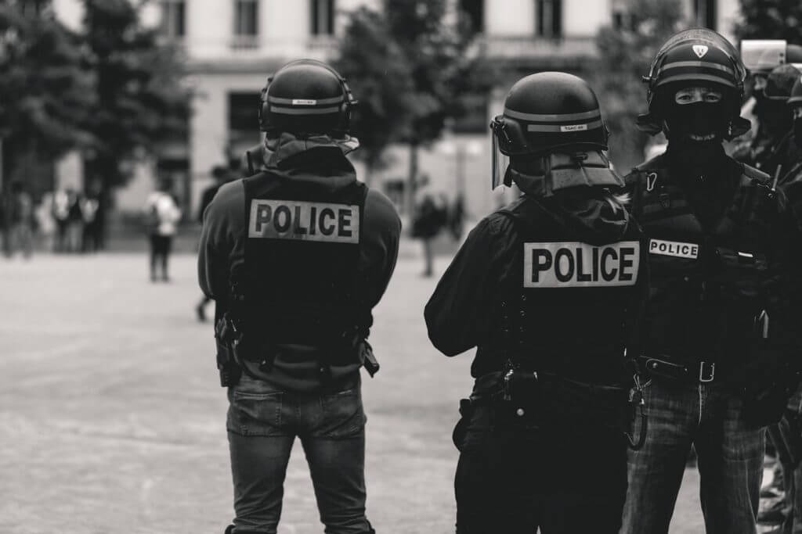

```{r setup, include=FALSE}
knitr::opts_chunk$set(echo = FALSE)
```

```{r, echo = FALSE, fig.align = 'center',preview=TRUE,fig.show = 'hold', out.width = '80%'} 
  
```
<cite> Image Source: [National Police Accountability Project](https://www.nlg-npap.org/) </cite>

# Abstract
The deaths of unarmed black citizens at the hands of police have led to dramatic calls for police reform. Some observers claim that officers are poorly trained and unaccountable for their actions. In this study, I test whether measures of organizational training and accountability reduce the likelihood of unarmed fatal officer-involved shootings (OIS). The results suggest external review of deadly force may decrease the likelihood of fatal OIS of unarmed black citizens. Other training and accountability mechanisms are unrelated to, or increase the likelihood of, fatal shootings. More research is needed to determine the causal links between the training and accountability mechanisms outlined in this study and fatal police shootings.

### Citation 
O’Guinn, B.J. (2022). Police training and accountability: A remedy or an impediment for reducing unarmed police shootings. _Crime and Delinquency_. [(Online first)](https://journals.sagepub.com/doi/10.1177/00111287221074959)

