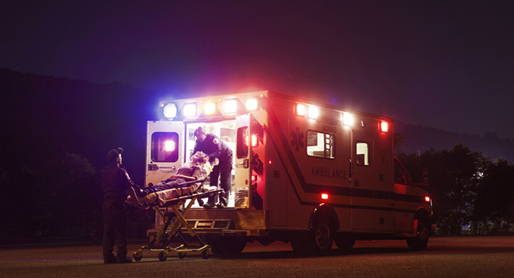

```{r setup, include=FALSE}
knitr::opts_chunk$set(echo = FALSE)
```

```{r, echo = FALSE, fig.align = 'center',preview=TRUE,fig.show = 'hold', out.width = '80%'} 
  
```
<cite> Image Creator: Cavan Images. Credit: Getty Images/Cavan Images R. </cite>


# Abstract
Past research on factors influencing firearm assault (FA) mortality have not focused on police officers who, compared to other U.S. workers and the general public, experience especially high rates of firearm victimization. This study focuses on this unique population of FA victims and examines the relationship between travel time to the nearest trauma care facility and the probability of survival among officers shot on duty. Combining data on trauma care center location and 7 years of data on U.S. police officers fatally or non-fatally assaulted with a firearm, we use logistic regression to model the probability of FA fatality among police by proximity of the FA to the nearest trauma care facility. We find that travel time to trauma care was not associated with reduced FA mortality among police from 2014 to 2020. FA mortality was significantly lower in 2020 than the six years prior.


### Citation 
Sierra-Arévalo, M., Nix, J., & O'Guinn, B. (2022). A national analysis of trauma care proximity and firearm assault survival among U.S. police. _Police Practice and Research: An International Journal_. [(Online first)](https://www.tandfonline.com/doi/full/10.1080/15614263.2022.2036611?cookieSet=1)

